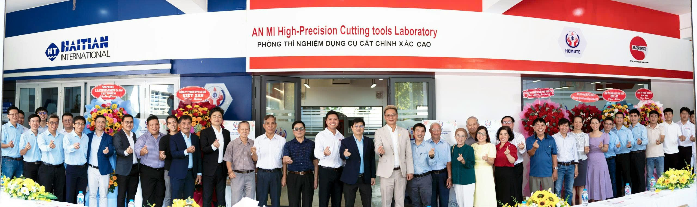
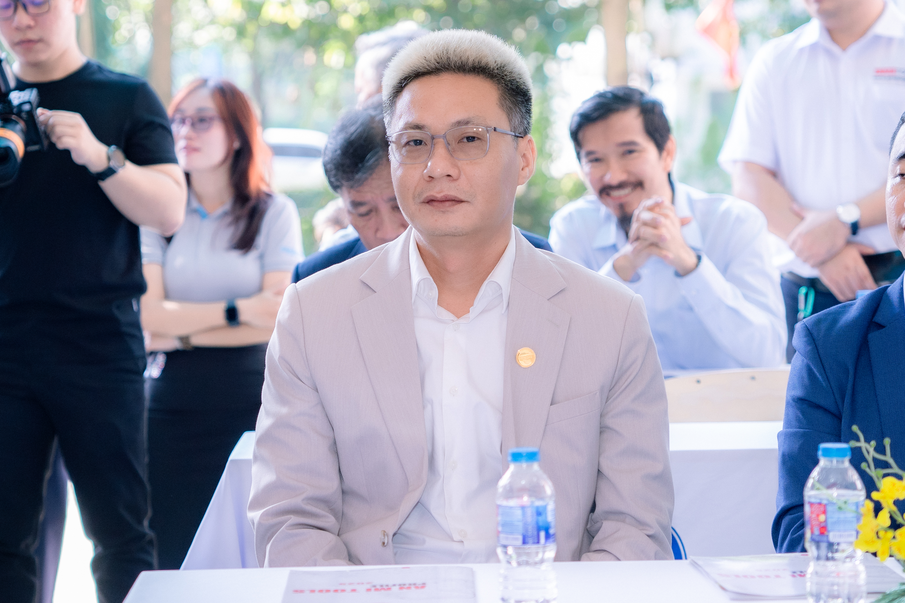
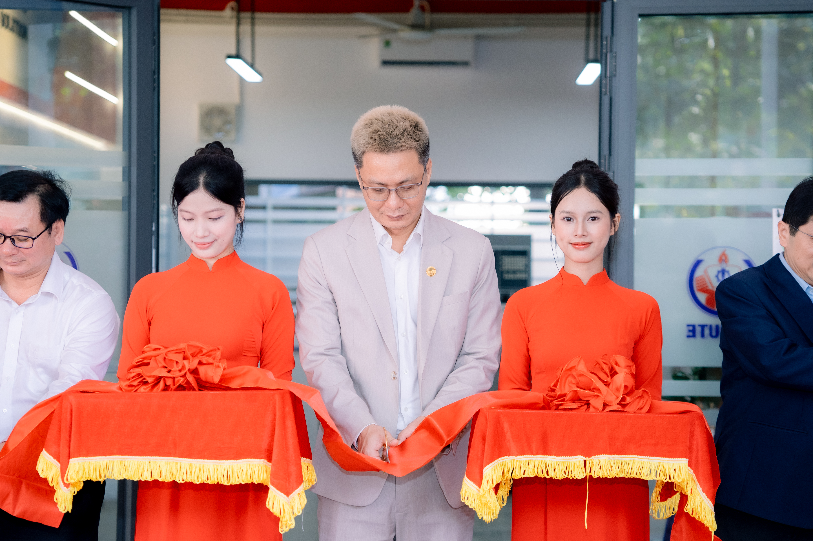
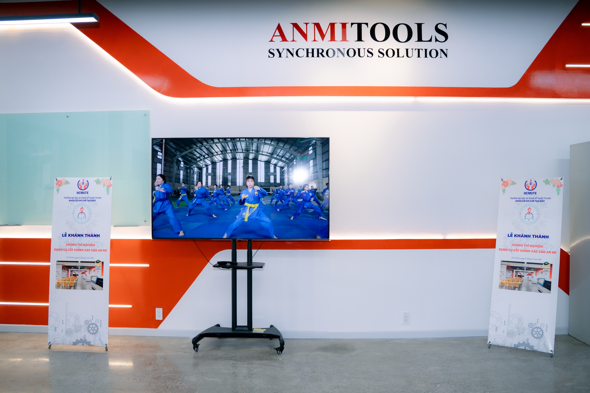
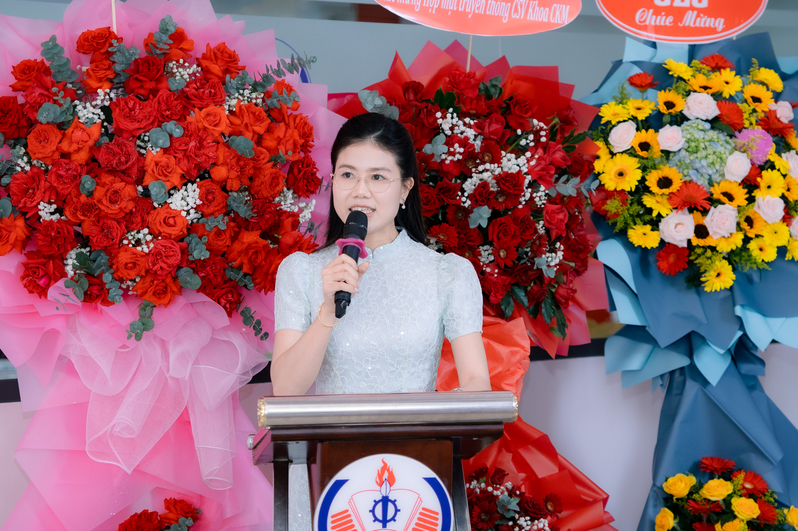
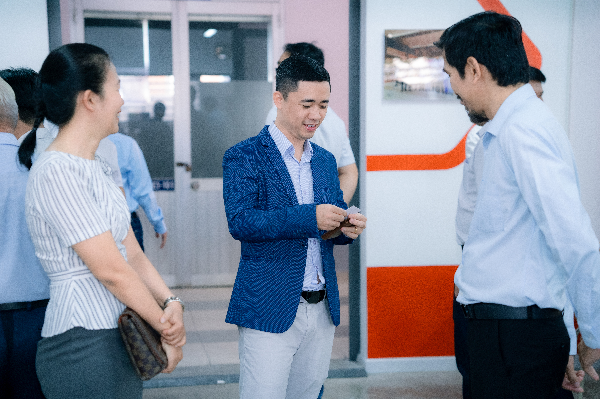

## AN MI TOOLS VÀ HCMUTE: KHÁNH THÀNH PHÒNG THÍ NGHIỆM TRỌNG ĐIỂM – BƯỚC NGOẶT CHO NGÀNH CƠ KHÍ CHÍNH XÁC VIỆT NAM

Từ một doanh nghiệp nội địa đầy khát vọng, **An Mi Tools** đã khẳng định vị thế khi bắt tay cùng Trường Đại học Sư phạm Kỹ thuật TP.HCM (**HCMUTE**) khánh thành **Phòng thí nghiệm Dụng cụ cắt chính xác cao** (21/12/2025). Sự kiện là cột mốc quan trọng nhằm giảm phụ thuộc vào công nghệ nước ngoài và nâng tầm nguồn nhân lực kỹ thuật Việt Nam.

_Toàn cảnh buổi lễ khánh thành phòng thí nghiệm dụng cụ cắt chính xác cao._

---

### 1. An Mi Tools: Hành trình 16 năm khẳng định nội lực quốc gia

Với những độc giả lần đầu biết đến thương hiệu, **An Mi Tools** (Công ty TNHH Dụng cụ An Mi) là doanh nghiệp hoạt động trong lĩnh vực **dụng cụ cắt gọt cơ khí chính xác** tại Việt Nam. Thành lập từ năm 2009 và phát triển qua nhiều giai đoạn, An Mi hướng tới năng lực sản xuất và làm chủ công nghệ, từng bước đáp ứng các tiêu chuẩn kỹ thuật ngày càng cao của thị trường.

_CEO Nguyễn Hồng Phong – cầu nối giữa doanh nghiệp và giáo dục kỹ thuật._

---

### 2. Phòng thí nghiệm An Mi tại HCMUTE: Mô hình "Nhà máy trong Trường học"

Sự kiện khánh thành vào lúc **07:30 ngày 21/12/2025** không chỉ là hoạt động trao tặng thiết bị. Đây là bước hiện thực hóa mô hình **“Factory-in-School”**, giúp sinh viên tiếp cận thiết bị và tư duy sản xuất theo tiêu chuẩn công nghiệp ngay trong môi trường đào tạo.

#### Giải mã công nghệ lõi tại An Mi Lab

Phòng thí nghiệm tập trung vào các năng lực trọng yếu phục vụ chế tạo và kiểm soát chất lượng dụng cụ cắt:

- **Mài CNC 5 trục:** Tạo biên dạng dao phay, mũi khoan carbide nguyên khối, đáp ứng hình học phức tạp.
- **Công nghệ phủ PVD/DLC:** Tăng khả năng chống mài mòn và tuổi thọ dụng cụ trong nhiều điều kiện gia công.
- **Đo lường quang học:** Hướng tới kiểm soát dung sai ở mức micron (μm), phù hợp yêu cầu kiểm soát chất lượng nghiêm ngặt.

---

### 3. Khoảnh khắc lịch sử: Cắt băng khánh thành và kết nối tri thức

Buổi lễ diễn ra với sự tham dự của đại diện nhà trường và doanh nghiệp. Đây là minh chứng cho hợp tác nhiều bên, thúc đẩy chuyển giao tri thức và nâng cao năng lực thực hành.

_Nghi thức cắt băng – đánh dấu giai đoạn vận hành mới của phòng thí nghiệm._

Sau nghi thức, các đại biểu tham quan và quan sát hoạt động thiết bị, thảo luận các nội dung kỹ thuật và định hướng đào tạo.

_Tham quan thực tế và trao đổi kỹ thuật tại phòng thí nghiệm._

---

### 4. Tầm nhìn 2026–2030: Đào tạo thế hệ "kỹ sư dụng cụ" tinh hoa

Phòng thí nghiệm hướng tới việc hỗ trợ đào tạo đội ngũ kỹ sư có khả năng tiếp cận sâu về **dụng cụ cắt**: từ lựa chọn – vận hành – kiểm tra chất lượng đến tư duy thiết kế và chế tạo. Đây là nền tảng quan trọng để mở rộng năng lực công nghiệp hỗ trợ và nâng cao sức cạnh tranh của ngành cơ khí chính xác.

_Đại diện nhà trường phát biểu, khẳng định sự đồng hành và cam kết triển khai._

---

### 5. Sự tri ân và tiếp nối của các thế hệ cựu sinh viên

Dự án còn thể hiện tinh thần gắn kết của cộng đồng kỹ thuật: cựu sinh viên đồng hành cùng nhà trường và thế hệ sinh viên mới. Văn hóa **“Pay it forward”** (đền đáp – tiếp nối) tạo nên hệ sinh thái bền vững giữa giáo dục và doanh nghiệp.

_Cựu sinh viên và sinh viên cùng hội tụ – tinh thần tiếp nối của cộng đồng kỹ thuật._

---

### Kết luận

**An Mi Tools** cho thấy một hướng đi rõ ràng: muốn tiến tới tự chủ công nghệ và nâng cao năng lực sản xuất, phải bắt đầu từ **đào tạo con người** và **hệ thống thực hành chuẩn công nghiệp**. Phòng thí nghiệm tại HCMUTE là bước khởi đầu quan trọng để kết nối tri thức – thiết bị – thực tiễn, góp phần thúc đẩy ngành cơ khí chính xác Việt Nam phát triển bền vững.
