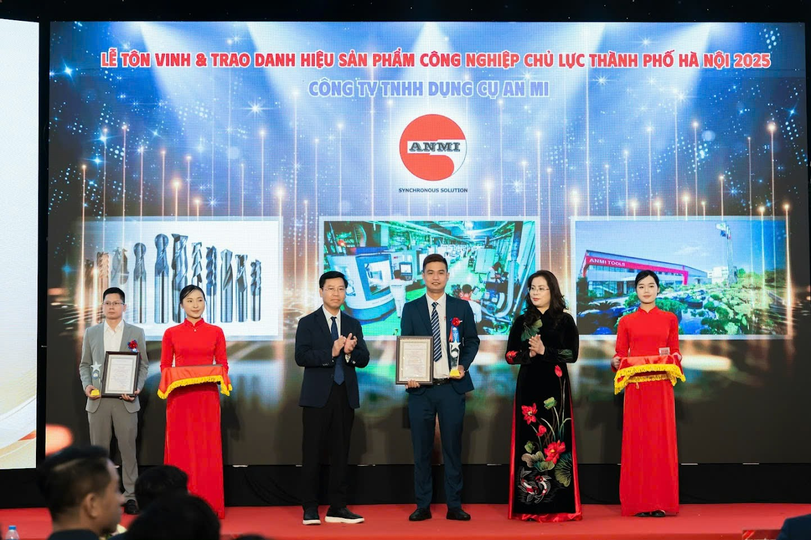
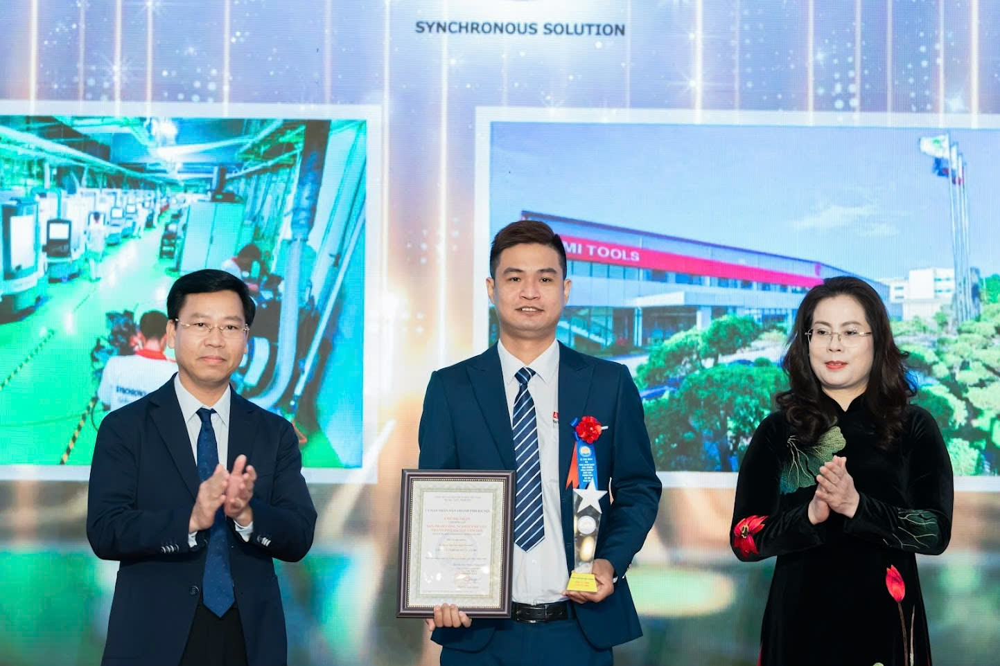
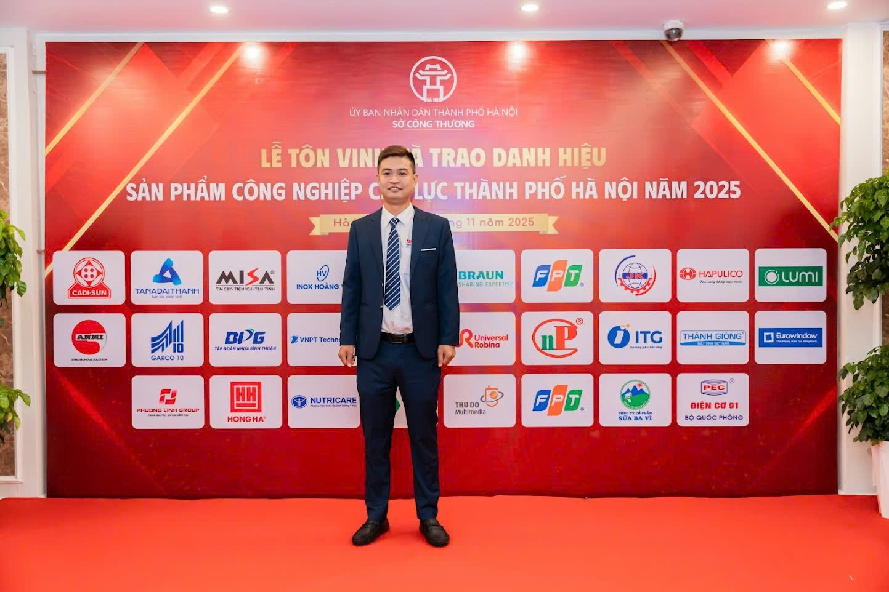
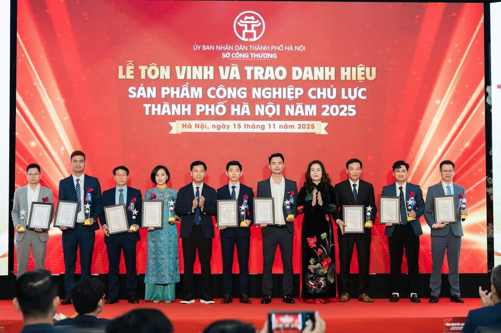
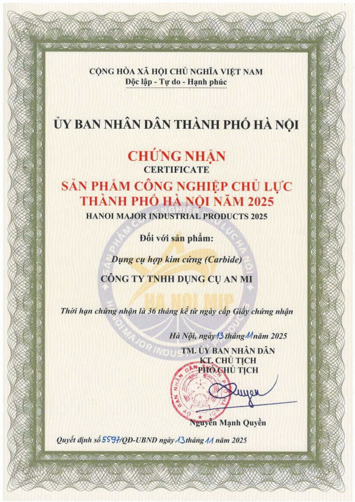

<section class="an-mi-tools-danh-hieu-2025">

## Giới thiệu

Ngày 15 tháng 11 năm 2025 đánh dấu cột mốc quan trọng trong hành trình phát triển của **An Mi Tools** khi công ty vinh dự nhận danh hiệu **Sản phẩm Công nghiệp Chủ lực Thành phố Hà Nội năm 2025** do Ủy ban Nhân dân Thành phố Hà Nội và Sở Công Thương Hà Nội trao tặng. Sản phẩm được tôn vinh là dụng cụ hợp kim cứng (Carbide) - dòng sản phẩm mang tính chiến lược của công ty trong lĩnh vực chế tạo dụng cụ cắt gọt và cơ khí chính xác.

**Danh hiệu 2025** này không chỉ là sự ghi nhận cho chất lượng sản phẩm vượt trội mà còn khẳng định vai trò trụ cột của **An Mi Tools** trong ngành công nghiệp chế tạo Thủ đô. Đây là minh chứng rõ nét cho sự nỗ lực không ngừng của công ty trong việc đổi mới công nghệ, nâng cao chất lượng sản phẩm và ứng dụng các giải pháp tiên tiến vào quy trình sản xuất. Với năng lực cạnh tranh ngày càng mạnh mẽ trên thị trường trong nước và quốc tế, **An Mi Tools** đã và đang đóng góp thiết thực vào sự phát triển bền vững của ngành cơ khí và công nghiệp hỗ trợ **Hà Nội** nói riêng và Việt Nam nói chung.

Trong bối cảnh **sản phẩm công nghiệp chủ lực** đang trở thành động lực quan trọng thúc đẩy nền kinh tế địa phương, danh hiệu này càng thể hiện cam kết mạnh mẽ của **An Mi Tools** trong việc tiếp tục mang đến những sản phẩm và dịch vụ chính xác, bền bỉ, đạt chuẩn quốc tế cho khách hàng và đối tác.

---

## Thông tin chi tiết về danh hiệu

### Danh hiệu Sản phẩm Công nghiệp Chủ lực Thành phố Hà Nội 2025

**Danh hiệu Sản phẩm Công nghiệp Chủ lực Thành phố Hà Nội năm 2025** là chương trình tôn vinh thường niên do Ủy ban Nhân dân Thành phố Hà Nội và Sở Công Thương Hà Nội tổ chức nhằm ghi nhận và vinh danh những doanh nghiệp có sản phẩm đạt chất lượng cao, đóng góp tích cực vào phát triển kinh tế - xã hội của Thủ đô. Năm 2025, có tổng cộng **35 sản phẩm** của **28 doanh nghiệp** được vinh danh, trong đó **An Mi Tools** tự hào là một trong những đơn vị được lựa chọn.

Tổng doanh thu của 35 sản phẩm được công nhận đạt gần **42 nghìn tỷ đồng**, trong đó doanh thu xuất khẩu đạt khoảng **190 triệu USD**. Con số này không chỉ phản ánh quy mô và tầm ảnh hưởng của các **danh hiệu sản phẩm công nghiệp** được tôn vinh mà còn cho thấy tiềm năng phát triển mạnh mẽ của ngành công nghiệp chế tạo **Hà Nội 2025**.

### Tiêu chí xét chọn nghiêm ngặt

Để đạt được danh hiệu này, các sản phẩm phải vượt qua nhiều **tiêu chí xét chọn** khắt khe. Trong đó, các yếu tố then chốt bao gồm:

- **Chất lượng sản phẩm vượt trội**: Đáp ứng tiêu chuẩn quốc gia và quốc tế, có khả năng cạnh tranh trên thị trường toàn cầu
- **Độ đổi mới công nghệ**: Ứng dụng công nghệ hiện đại, tự động hóa và chuyển đổi số trong quy trình sản xuất
- **Năng lực cạnh tranh**: Sản phẩm có uy tín thương hiệu, chiếm thị phần ổn định và tăng trưởng bền vững
- **Doanh thu và hiệu quả kinh doanh**: Đóng góp tích cực vào GDP địa phương và tạo việc làm cho người lao động
- **Phát triển bền vững**: Tuân thủ các quy định về môi trường, an toàn lao động và trách nhiệm xã hội

Việc **An Mi Tools** được công nhận trong số 28 doanh nghiệp tiêu biểu là minh chứng rõ ràng cho sự xuất sắc của công ty trên tất cả các tiêu chí này, đặc biệt trong bối cảnh cạnh tranh gay gắt của ngành công nghiệp chế tạo hiện nay.

---

## Về An Mi Tools - Lịch sử và phát triển

### Hành trình xây dựng thương hiệu

**An Mi Tools** được thành lập vào năm **2009** dưới sự lãnh đạo của **CEO Nguyễn Hồng Phong** với tầm nhìn xây dựng một doanh nghiệp dẫn đầu Việt Nam trong lĩnh vực chế tạo dụng cụ cắt gọt và cơ khí chính xác. Khởi đầu từ một xưởng sản xuất nhỏ, sau hơn 16 năm phát triển, công ty đã trở thành đối tác tin cậy của nhiều tập đoàn lớn trong và ngoài nước.

**Lịch sử An Mi Tools** ghi dấu bằng những bước tiến vững chắc. Công ty chuyên sâu vào các lĩnh vực: **chế tạo dụng cụ cắt gọt**, **mài chính xác**, **chế tạo chi tiết cơ khí chính xác** và **dịch vụ tráng phủ PVD**. Danh sách khách hàng của **An Mi Tools** bao gồm các tên tuổi lớn như **Samsung**, **Honda**, **Toyota**, cùng nhiều doanh nghiệp uy tín từ Đức và các đối tác trong ngành ô tô, xe máy, hàng không, dầu khí, y tế và điện tử.

### Mạng lưới hoạt động và quy mô

Hiện tại, **An Mi Tools** có mạng lưới hoạt động rộng khắp với các chi nhánh tại **Hà Nội**, **Thành phố Hồ Chí Minh** và **Hưng Yên**. Nhà máy sản xuất chính tại Hưng Yên được trang bị máy móc hiện đại nhập khẩu từ Đức, Nhật Bản và Thụy Sĩ, đảm bảo năng lực sản xuất đạt tiêu chuẩn quốc tế.

Lực lượng lao động của công ty đã tăng trưởng lên hơn **300 nhân viên**, trong đó có nhiều kỹ sư và chuyên gia giàu kinh nghiệm trong lĩnh vực cơ khí chính xác. Đây là nền tảng quan trọng giúp **An Mi Tools** duy trì và nâng cao chất lượng sản phẩm, đáp ứng nhu cầu ngày càng cao của khách hàng.

### Tăng trưởng doanh thu ấn tượng

Con số **doanh thu** của **An Mi Tools** là minh chứng rõ nét cho quỹ đạo **phát triển doanh nghiệp** vượt bậc. Từ mức **235 tỷ đồng** vào năm **2022**, công ty đặt mục tiêu đạt doanh thu **800-1.000 tỷ đồng** vào năm **2025** và hướng tới con số **2.000 tỷ đồng** vào năm **2030**. Tốc độ tăng trưởng này không chỉ đến từ việc mở rộng quy mô sản xuất mà còn nhờ vào chiến lược đầu tư vào nghiên cứu phát triển (R&D), ứng dụng công nghệ tiên tiến và xây dựng mối quan hệ bền vững với khách hàng.

### Sứ mệnh và khát vọng

**Sứ mệnh** của **An Mi Tools** là trở thành **công ty sản xuất kinh doanh dụng cụ cắt gọt, cơ khí chính xác hàng đầu Việt Nam**. Công ty cam kết mang đến những sản phẩm chất lượng cao, giúp khách hàng tối ưu hóa quy trình sản xuất, giảm chi phí và nâng cao năng suất.

**Khát vọng** lớn hơn của **An Mi Tools** là ghi danh nền công nghiệp Việt Nam trên bản đồ công nghiệp thế giới. Công ty không chỉ hướng đến việc chinh phục thị trường trong nước mà còn mở rộng sang các thị trường quốc tế khó tính như Đức, Nga và các nước phát triển khác. Với tầm nhìn dài hạn và quyết tâm không ngừng đổi mới, **An Mi Tools** đang từng bước hiện thực hóa giấc mơ đưa thương hiệu Việt vươn tầm thế giới.

---

<!-- HÌNH ẢNH HÀNG 1: GIỚI THIỆU - 2 CỘT -->

  <figure class="image-wrapper">
    
    <figcaption>Lãnh đạo Sở Công Thương Hà Nội trao danh hiệu Sản phẩm Công nghiệp Chủ lực cho đại diện An Mi Tools trong lễ tôn vinh ngày 15/11/2025</figcaption>
  </figure>

  <figure class="image-wrapper">
    
    <figcaption>Chứng chỉ Sản phẩm Công nghiệp Chủ lực Thành phố Hà Nội 2025 do Ủy ban Nhân dân Hà Nội cấp cho An Mi Tools, công nhận dụng cụ hợp kim cứng (Carbide) đạt tiêu chuẩn quốc tế</figcaption>
  </figure>

---

## Sản phẩm được vinh danh: Dụng cụ hợp kim cứng (Carbide)

### Dụng cụ hợp kim cứng - Trụ cột của ngành gia công cơ khí hiện đại

Sản phẩm được tôn vinh trong danh hiệu Sản phẩm Công nghiệp Chủ lực Hà Nội 2025 là **dụng cụ hợp kim cứng (Carbide)** - dòng sản phẩm chiến lược của An Mi Tools. Với đặc tính độ bền cao, khả năng chịu nhiệt tốt và độ chính xác vượt trội, **carbide tools** đã trở thành giải pháp không thể thiếu trong các ngành công nghiệp đòi hỏi độ chính xác cao.

### Ứng dụng rộng rãi trong nhiều lĩnh vực then chốt

**Dụng cụ hợp kim cứng** của An Mi Tools được ứng dụng gia công trong các ngành công nghiệp quan trọng: ô tô, xe máy, hàng không vũ trụ, dầu khí, thiết bị y tế, điện tử, và sản xuất khuôn mẫu. Từng chi tiết trong động cơ ô tô, linh kiện máy bay, thiết bị y tế chính xác đến vi mô - tất cả đều cần đến sự tỉ mỉ và chất lượng mà sản phẩm carbide của An Mi Tools mang lại.

### Tính năng thế mạnh - Công nghệ tiên tiến

An Mi Tools tự hào sở hữu năng lực sản xuất các loại dao đặc biệt được thiết kế riêng cho từng ứng dụng gia công cụ thể: phay chữ T, dao nhiều bậc, dao định hình phức tạp, và đặc biệt là **doa chính xác cao** với vật liệu hàn hợp kim, hợp kim nguyên khối, và thậm chí cả kim cương công nghiệp.

Để đạt được chất lượng đó, An Mi Tools đầu tư hệ thống máy móc hiện đại nhập khẩu từ **Đức, Nhật Bản, Thụy Sĩ** - những quốc gia dẫn đầu thế giới về công nghệ chế tạo dụng cụ cắt gọt. Kết hợp với công nghệ tự động hóa, mài chính xác và đặc biệt là công nghệ **tráng phủ PVD** (Physical Vapor Deposition), sản phẩm của An Mi Tools đạt tiêu chuẩn quốc tế, có khả năng cạnh tranh với các thương hiệu hàng đầu thế giới.

---

<!-- HÌNH ẢNH HÀNG 2: DANH HIỆU & LỊCH SỬ - 2 CỘT -->

  <figure class="image-wrapper">
    
    <figcaption>Đại diện An Mi Tools tự hào tại lễ tôn vinh sản phẩm công nghiệp chủ lực Hà Nội 2025, khẳng định vị thế doanh nghiệp hàng đầu Việt Nam</figcaption>
  </figure>

  <figure class="image-wrapper">
    
    <figcaption>Các doanh nghiệp tiêu biểu nhận danh hiệu trong lễ tôn vinh sản phẩm công nghiệp chủ lực Hà Nội 2025, khẳng định sự đóng góp của doanh nghiệp Thủ đô cho phát triển kinh tế</figcaption>
  </figure>

---

## Lý do vinh danh và đóng góp của An Mi Tools

### 1. Chất lượng sản phẩm vượt trội

**Chất lượng vượt trội** là yếu tố cốt lõi giúp An Mi Tools chinh phục những khách hàng khó tính nhất. Sản phẩm **dụng cụ hợp kim cứng** của công ty đáp ứng các tiêu chuẩn quốc tế nghiêm ngặt, được các tập đoàn đa quốc gia như Samsung, Honda, Toyota tin tưởng lựa chọn. Chất lượng không chỉ dừng ở sản phẩm mà còn thể hiện qua quy trình kiểm soát chất lượng khắt khe từ khâu nguyên liệu đến thành phẩm.

### 2. Năng lực cạnh tranh mạnh mẽ

**Năng lực cạnh tranh** của An Mi Tools không chỉ đến từ chất lượng mà còn từ khả năng đáp ứng đúng tiến độ, tối ưu chi phí và duy trì sự ổn định trong từng đơn hàng. Công ty đã xây dựng được lợi thế cạnh tranh bền vững thông qua việc làm chủ công nghệ, tự chủ sản xuất và không ngừng cải tiến quy trình.

### 3. Đóng góp vào sự phát triển ngành cơ khí Hà Nội

An Mi Tools góp phần quan trọng trong việc giảm phụ thuộc vào **dụng cụ hợp kim cứng** nhập khẩu, giúp các doanh nghiệp Việt Nam chủ động hơn trong chuỗi cung ứng. Sản phẩm nội địa hóa không chỉ tiết kiệm chi phí mà còn đẩy mạnh năng lực gia công của toàn ngành, góp phần vào mục tiêu phát triển công nghiệp của Thủ đô.

### 4. Uy tín thương hiệu quốc tế

An Mi Tools đã thiết lập quan hệ hợp tác thành công với các đối tác tại Đức - một trong những thị trường khó tính nhất thế giới về chất lượng sản phẩm công nghiệp. Công ty hiện đang tích cực thăm dò và mở rộng sang thị trường Nga, khẳng định uy tín thương hiệu An Mi Tools trên bản đồ công nghiệp toàn cầu.

### 5. Đổi mới công nghệ không ngừng

Tiên phong trong **đổi mới công nghệ**, An Mi Tools đã áp dụng tự động hóa, chuyển đổi số và xây dựng nhà máy thông minh (Smart Factory). Việc ứng dụng công nghệ 4.0 không chỉ nâng cao năng suất mà còn tạo ra môi trường sản xuất hiện đại, linh hoạt và dễ dàng kiểm soát chất lượng.

### 6. Cam kết phát triển bền vững

**Phát triển bền vững** là một trong những giá trị cốt lõi của An Mi Tools. Công ty sử dụng năng lượng xanh từ hệ thống pin mặt trời, bảo vệ môi trường thông qua các biện pháp xử lý chất thải đúng chuẩn, và đặc biệt duy trì hoạt động tái chế 40-50 sản phẩm mỗi tháng - góp phần giảm thiểu lãng phí và bảo vệ tài nguyên.

### 7. Xây dựng đội ngũ nhân lực chất lượng cao

An Mi Tools hiểu rằng công nghệ tiên tiến chỉ phát huy hiệu quả khi có đội ngũ nhân lực chất lượng cao. Công ty không ngừng đầu tư vào đào tạo, phát triển kỹ năng cho 300+ cán bộ công nhân viên, tạo môi trường làm việc chuyên nghiệp và cơ hội phát triển bền vững cho mỗi thành viên.

---

<!-- HÌNH ẢNH HÀNG 3: SẢN PHẨM & LÝ DO VINH DANH - FULL WIDTH 1 CỘT -->

  <figure class="image-wrapper-full">
    
    <figcaption>Đại diện An Mi Tools với chứng chỉ danh hiệu, khẳng định sự nỗ lực không ngừng trong nâng cao chất lượng sản phẩm hợp kim cứng (Carbide) và ứng dụng công nghệ tiên tiến trong sản xuất, tạo nên sức mạnh cạnh tranh trên thị trường quốc tế</figcaption>
  </figure>

---

## Tương lai và mục tiêu phát triển

### Mục tiêu ngắn hạn: Nâng tầm chất lượng đạt chuẩn quốc tế

Với danh hiệu Sản phẩm Công nghiệp Chủ lực Hà Nội 2025, An Mi Tools tiếp tục đặt ra **mục tiêu phát triển** tập trung vào việc nâng cao toàn diện chất lượng sản phẩm, hướng đến chuẩn quốc tế và vượt qua các kỳ vọng của khách hàng. Mỗi sản phẩm **dụng cụ hợp kim cứng** phải không chỉ đáp ứng mà còn vượt trội so với các tiêu chuẩn nghiêm ngặt nhất.

### Chinh phục mục tiêu doanh thu đầy tham vọng

Từ con số 235 tỷ đồng năm 2022, An Mi Tools đặt ra **mục tiêu doanh thu** đạt 800-1.000 tỷ đồng vào năm 2025 và 2.000 tỷ đồng vào năm 2030. Đây không chỉ là con số về tài chính mà còn là minh chứng cho sự tăng trưởng bền vững, mở rộng thị phần và khẳng định vị thế của **An Mi Tools** trong ngành công nghiệp cơ khí Việt Nam.

### Khát vọng dẫn đầu và vươn tầm thế giới

"**Tương lai An Mi Tools**" gắn liền với khát vọng trở thành công ty sản xuất kinh doanh dụng cụ cắt gọt, cơ khí chính xác hàng đầu Việt Nam. Không dừng lại ở thị trường trong nước, An Mi Tools hướng tới việc chinh phục khách hàng toàn cầu, mang thương hiệu Việt Nam vươn xa trên bản đồ công nghiệp thế giới.

### Chiến lược kinh doanh: Làm chủ công nghệ, thống lĩnh thị trường

**Chiến lược kinh doanh** của An Mi Tools tập trung vào đầu tư R&D (nghiên cứu và phát triển), làm chủ công nghệ sản xuất **carbide tools**, và không ngừng đổi mới để thống lĩnh thị trường. Công ty cam kết tiếp tục đầu tư vào máy móc hiện đại, nâng cao năng lực tự chủ công nghệ và phát triển các sản phẩm đột phá đáp ứng nhu cầu ngày càng cao của ngành công nghiệp 4.0.

### Cam kết ghi danh công nghiệp Việt trên bản đồ thế giới

An Mi Tools không chỉ hướng đến lợi ích doanh nghiệp mà còn mang trong mình sứ mệnh lớn lao: Ghi danh nền công nghiệp Việt Nam trên bản đồ công nghiệp thế giới. Mỗi sản phẩm được xuất khẩu là một lần khẳng định năng lực, chất lượng và uy tín của thương hiệu Việt trên trường quốc tế.

---

## Lời cảm ơn và cam kết

### Trân trọng cảm ơn

An Mi Tools xin trân trọng gửi lời **cảm ơn** chân thành nhất đến Quý khách hàng, đối tác đã tin tưởng và đồng hành cùng công ty trong suốt hành trình phát triển. Cảm ơn tập thể hơn 300 cán bộ công nhân viên An Mi Tools - những người đã cống hiến hết mình để tạo nên từng sản phẩm **chất lượng** đạt chuẩn quốc tế.

Đặc biệt, An Mi Tools xin bày tỏ lòng biết ơn sâu sắc đến Sở Công Thương Hà Nội, Ủy ban Nhân dân Thành phố Hà Nội đã công nhận và tôn vinh công ty với danh hiệu Sản phẩm Công nghiệp Chủ lực Hà Nội 2025. Đây là động lực to lớn để An Mi Tools tiếp tục nỗ lực và vươn xa hơn nữa.

### Cam kết không ngừng nâng cao

Danh hiệu này không chỉ là vinh dự mà còn là trách nhiệm. An Mi Tools **cam kết** tiếp tục mang đến những sản phẩm, dịch vụ chính xác, bền bỉ, đạt chuẩn quốc tế. Mỗi dụng cụ cắt gọt, mỗi chi tiết cơ khí chính xác rời khỏi nhà máy đều mang theo tâm huyết, uy tín và **chất lượng** mà khách hàng xứng đáng nhận được.

### Kêu gọi sự đồng hành

An Mi Tools kêu gọi sự đồng hành của Quý khách hàng, đối tác trong hành trình tới. Cùng nhau, chúng ta sẽ xây dựng một ngành công nghiệp cơ khí Việt Nam mạnh mẽ, tự chủ và có sức cạnh tranh cao trên thị trường quốc tế.

### Niềm tin vào phát triển bền vững

Với niềm tin vào sự phát triển **bền vững**, An Mi Tools hướng tới tương lai nơi sản phẩm Việt Nam được thế giới công nhận, nơi thương hiệu An Mi Tools trở thành biểu tượng của chất lượng, công nghệ và trách nhiệm với cộng đồng. Hành trình còn dài, nhưng với quyết tâm và sự đồng hành của mọi người, An Mi Tools tin tưởng sẽ đạt được những mục tiêu đầy tham vọng đã đề ra.

---

**An Mi Tools - Ghi danh công nghiệp Việt trên bản đồ thế giới.**

</section>

<!-- JSON-LD SCHEMA: PRODUCT -->

<!-- JSON-LD SCHEMA: BREADCRUMB -->

