Kế hoạch học tập 15 ngày: Xây dựng Trung tâm Tải tài liệu trên WordPress
========================================================================

```mermaid
gantt
  title Thời khóa biểu hàng ngày – Lặp lại 15 ngày
  dateFormat  HH:mm
  axisFormat  %H:%M

  section Buổi sáng
  Biên tập & upload hình ảnh  :img,   08:00, 4h

  section Trưa
  Nghỉ trưa                   :break, 12:00, 1h

  section Buổi chiều
  Làm đồ án                   :proj,  13:00, 2h
  Học WordPress (Download Center) :learn, 15:00, 2h
```

## Tóm tắt nội dung

Tài liệu này là kế hoạch học tập trong 15 ngày, hướng dẫn bạn từ khái niệm cơ bản đến triển khai hoàn chỉnh một “Trung tâm Tải tài liệu” (Download/Resource Center) trên nền tảng WordPress. Mỗi ngày bao gồm phần lý thuyết và bài tập thực hành với thời lượng 1–2 giờ, tập trung vào các chủ đề như tạo Custom Post Type, quản lý tệp, tùy chỉnh giao diện, phân quyền, bảo mật và tối ưu hiệu suất. Kết thúcplan, bạn sẽ có một module download riêng biệt, thân thiện với người dùng và sẵn sàng đưa vào vận hành.

## Mục lục

- [Giới thiệu](#giới-thiệu)  
- [Điều kiện tiên quyết](#điều-kiện-tiên-quyết)  
- [Tổng quan kế hoạch](#tổng-quan-kế-hoạch)  
- [Lịch trình chi tiết](#lịch-trình-chi-tiết)  
  - [Ngày 1: Cơ bản về WordPress](#ngày-1-cơ-bản-về-wordpress)  
  - [Ngày 2: Child Theme & Tùy chỉnh](#ngày-2-child-theme--tùy-chỉnh)  
  - [Ngày 3: Custom Post Type & Taxonomy](#ngày-3-custom-post-type--taxonomy)  
  - [Ngày 4: Advanced Custom Fields (ACF)](#ngày-4-advanced-custom-fields-acf)  
  - [Ngày 5: Thư viện Phương tiện & Quản lý tệp](#ngày-5-thư-viện-phương-tiện--quản-lý-tệp)  
  - [Ngày 6: Giới thiệu Download Monitor](#ngày-6-giới-thiệu-download-monitor)  
  - [Ngày 7: Tùy chỉnh Download Monitor](#ngày-7-tùy-chỉnh-download-monitor)  
  - [Ngày 8: Xây dựng Download Center thủ công](#ngày-8-xây-dựng-download-center-thủ-công)  
  - [Ngày 9: Metadata & File Attachment](#ngày-9-metadata--file-attachment)  
  - [Ngày 10: Template & Archive](#ngày-10-template--archive)  
  - [Ngày 11: Bộ lọc & Tìm kiếm AJAX](#ngày-11-bộ-lọc--tìm-kiếm-ajax)  
  - [Ngày 12: Phân quyền & Kiểm soát truy cập](#ngày-12-phân-quyền--kiểm-soát-truy-cập)  
  - [Ngày 13: Bảo mật & Caching](#ngày-13-bảo-mật--caching)  
  - [Ngày 14: UX, Styling & Responsive](#ngày-14-ux-styling--responsive)  
  - [Ngày 15: Test, Triển khai & Documentation](#ngày-15-test-triển-khai--documentation)  
- [Các bước kế tiếp](#các-bước-kế-tiếp)

Giới thiệu
----------

Tài liệu này hướng dẫn bạn từng bước từ khái niệm cơ bản đến triển khai một Download Center sẵn sàng vận hành trên WordPress. Trong 15 ngày, bạn sẽ cân bằng giữa lý thuyết và thực hành, với mỗi buổi chỉ tập trung vào một chủ đề cụ thể để đảm bảo tiếp thu hiệu quả.

Điều kiện tiên quyết
--------------------

-   Đã cài đặt WordPress (bản mới nhất) trên máy chủ hoặc môi trường local.

-   Quyền quản trị đầy đủ (Dashboard, FTP/SSH).

-   Hiểu biết cơ bản về PHP, HTML, CSS.

-   Trình soạn thảo mã (VS Code, PhpStorm...) và Git (khuyến khích).

Tổng quan kế hoạch
------------------

Mỗi ngày chia làm hai phần:

1.  Lý thuyết & khái niệm

2.  Bài tập thực hành

Dành 1--2 giờ mỗi ngày và giữ phạm vi nhỏ để nắm vững trước khi chuyển sang chủ đề tiếp theo.

Lịch trình chi tiết
-------------------

### Ngày 1: Khởi tạo và Khám phá WordPress

Tài liệu đọc (2h)

-   Hướng dẫn cài đặt WordPress (wordpress.org/install/)

-   Bài viết "File and Directory Structure" trên WPBeginner

Thực hành (2h)

-   Cài đặt WordPress trên Local by Flywheel hoặc XAMPP

-   Khám phá thư mục wp-content, wp-includes, wp-admin

### Ngày 2: Child Theme & Enqueue Scripts

Tài liệu đọc (2h)

-   Codex: "Child Themes" (developer.wordpress.org/themes/advanced-topics/child-themes/)

-   Hướng dẫn enqueue styles & scripts (developer.wordpress.org/themes/basics/including-css-javascript/)

Thực hành (2h)

-   Tạo child theme từ Twenty Twenty-Three

-   Enqueue custom.css và custom.js

### Ngày 3: Custom Post Type & Taxonomy

Tài liệu đọc (2h)

-   Codex: register_post_type() (developer.wordpress.org/reference/functions/register_post_type/)

-   Bài hướng dẫn taxonomy (WPBeginner: "Custom Taxonomies")

Thực hành (2h)

-   Đăng ký CPT "Download"

-   Tạo taxonomy "Loại tài liệu" và "Chủ đề"

### Ngày 4: Advanced Custom Fields (ACF)

Tài liệu đọc (2h)

-   Trang chính ACF (www.advancedcustomfields.com/)

-   Hướng dẫn tạo Field Group và Field Types

Thực hành (2h)

-   Cài và kích hoạt plugin ACF

-   Tạo nhóm trường chứa file upload, select, text cho CPT Download

### Ngày 5: Media Library & Quản lý tệp

Tài liệu đọc (2h)

-   Codex: "Media Library" (developer.wordpress.org/themes/functionality/media-handling/)

-   Bài WPBeginner: "WordPress Media Library Guide"

Thực hành (2h)

-   Upload một PDF và hình ảnh qua Media Library

-   Gắn media vào bài "Download" qua ACF field

### Ngày 6: Giới thiệu Download Monitor

Tài liệu đọc (2h)

-   Trang plugin Download Monitor (wordpress.org/plugins/download-monitor/)

-   Hướng dẫn cơ bản trên Docs của Download Monitor

Thực hành (2h)

-   Cài và kích hoạt Download Monitor

-   Tạo một mục download mẫu và kiểm thử link

### Ngày 7: Tùy chỉnh Download Monitor

Tài liệu đọc (2h)

-   Shortcodes & Hooks (Docs Download Monitor)

-   Bài viết "Tracking Downloads with Download Monitor"

Thực hành (2h)

-   Hiển thị danh sách download qua shortcode trên trang riêng

-   Bật thống kê lượt tải và xem dashboard

### Ngày 8: Meta Box & Nonce

Tài liệu đọc (2h)

-   Codex: add_meta_box(), save_post(), wp_nonce_field()

-   Bài hướng dẫn "Secure Custom Meta Boxes"

Thực hành (2h)

-   Thêm meta box nhập URL tệp cho CPT Download

-   Thêm nonce kiểm chứng và lưu dữ liệu

### Ngày 9: Upload File Thủ Công

Tài liệu đọc (2h)

-   Codex: wp_handle_upload() (developer.wordpress.org/reference/functions/wp_handle_upload/)

-   Bài viết "Custom File Upload in WordPress"

Thực hành (2h)

-   Tạo form upload file trong admin area

-   Validate, lưu và attach file vào Download post

### Ngày 10: Template & Archive

Tài liệu đọc (2h)

-   Codex: Template Hierarchy (developer.wordpress.org/themes/basics/template-hierarchy/)

-   Hướng dẫn WP_Query Basics

Thực hành (2h)

-   Tạo file archive-download.php

-   Hiển thị loop các download với nút download

### Ngày 11: Bộ lọc & Tìm kiếm AJAX

Tài liệu đọc (2h)

-   Bài viết "Custom WordPress Queries with tax_query"

-   Hướng dẫn AJAX trong WordPress (developer.wordpress.org/plugins/javascript/ajax/)

Thực hành (2h)

-   Thêm dropdown lọc theo taxonomy

-   Tạo AJAX request để lọc danh sách

### Ngày 12: Phân quyền & Kiểm soát truy cập

Tài liệu đọc (2h)

-   Codex: current_user_can() & Roles (developer.wordpress.org/plugins/users/roles-and-capabilities/)

-   Bài viết "Restrict Content in WordPress"

Thực hành (2h)

-   Chỉ cho user đã đăng nhập tải tài liệu

-   Tạo role "Subscriber" và gán capability download

### Ngày 13: Bảo mật & Caching

Tài liệu đọc (2h)

-   Codex: Data Validation & Sanitization (developer.wordpress.org/plugins/security/data-validation-sanitization/)

-   Hướng dẫn Transients API

Thực hành (2h)

-   Thêm nonce & sanitize trước khi xuất file

-   Cache danh sách download qua set_transient()/get_transient()

### Ngày 14: UX, Styling & Responsive

Tài liệu đọc (2h)

-   Bài viết "Mobile-First Design Principles"

-   Hướng dẫn ARIA labels trong HTML

Thực hành (2h)

-   Style Download Center bằng CSS hoặc framework (Bootstrap/Tailwind)

-   Test giao diện trên mobile và chỉnh sửa

### Ngày 15: Test, Triển khai & Documentation

Tài liệu đọc (2h)

-   Bài viết "WordPress Deployment Best Practices"

-   Hướng dẫn viết README cho dự án Open Source

Thực hành (2h)

-   Kiểm tra toàn bộ chức năng và cross-browser

-   Viết README.md, changelog và hướng dẫn cài đặt

Các bước kế tiếp
----------------

-   Tích hợp thông báo email khi có download mới.

-   Triển khai tính năng download trả phí với Easy Digital Downloads.
